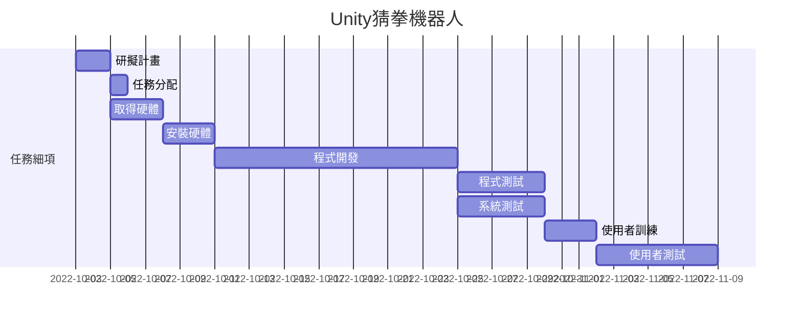
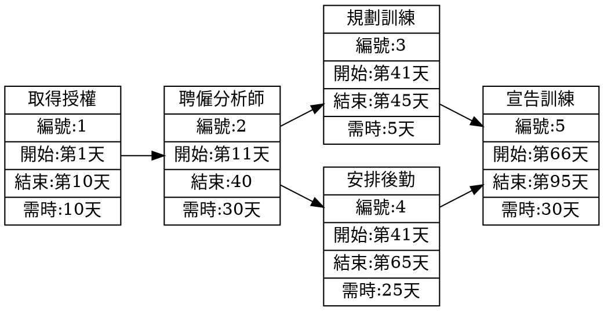

# 專題組題：Unity猜拳機器人

| **職位** | **學號** | **姓名** | **工作內容** |
| :---:| :---:| :---:| :----: |
| **組長** | C109118142 | 徐敏容 | 介面設計、程式開發 |
| 組員 | C109118111 | 簡言蓁 | 程式開發、系統測試 |
| 組員 | C109118140 | 林俞丞 | 程式開發、程式測試 |

***
# 內容
利用Unity開發一個機器人，使用者可以選擇要出「剪刀」、「石頭」、「布」任一拳，機器人也會隨機出拳，若玩家贏可以攻擊機器人，玩家輸拳即會被機器人攻擊。

***
# 甘特圖

***
# PERT/CPM

