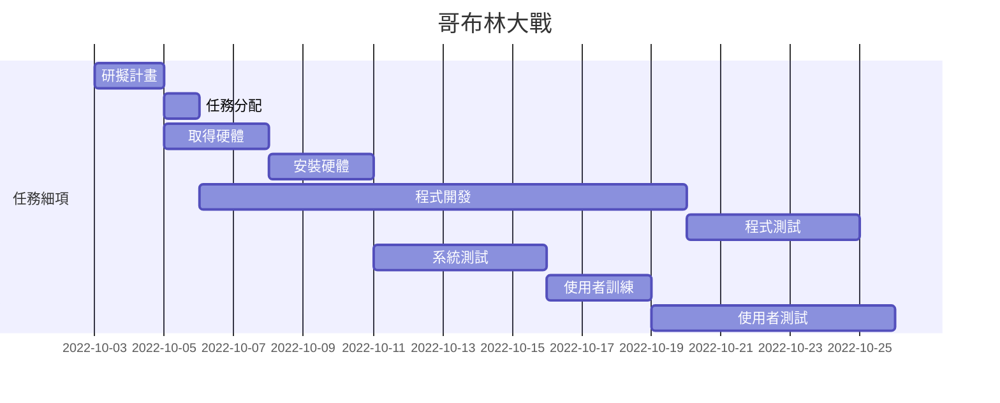
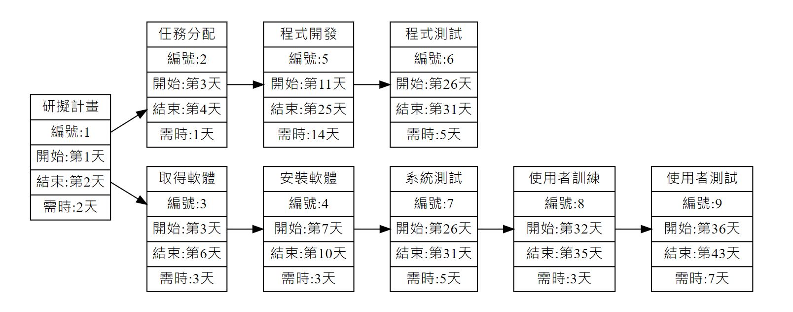

# 專題主題：哥布林大戰

| **職位** | **學號** | **姓名** | **工作內容** |
| :---:| :---:| :---:| :----: |
| **組長** | C109118142 | 徐敏容 | 介面設計、程式開發 |
| 組員 | C109118111 | 簡言蓁 | 程式開發、系統測試 |
| 組員 | C109118140 | 林俞丞 | 程式開發、程式測試 |

# 內容
利用Unity開發一個APP小遊戲，使用者可以選擇要出「剪刀」、「石頭」、「布」，機器人也會隨機出拳，若玩家猜贏即可攻擊哥布林，玩家猜輸則會被機器人攻擊。

# 甘特圖

# PERT/CPM

關鍵路徑：１＞３＞４＞７＞８＞９

