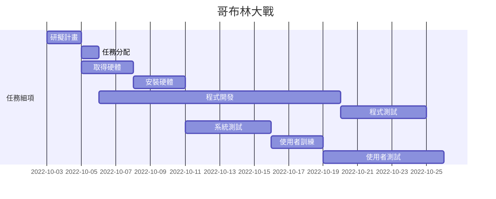
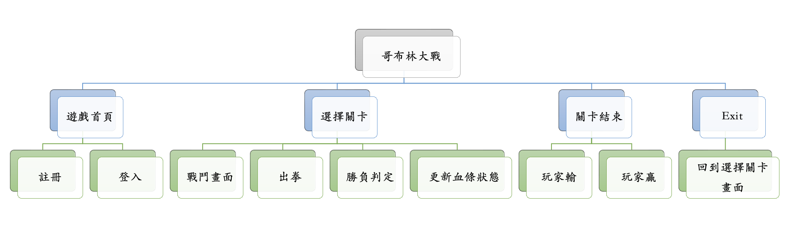
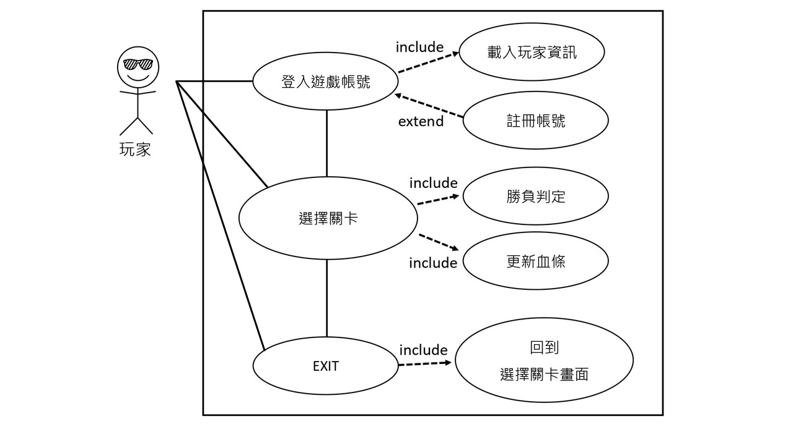
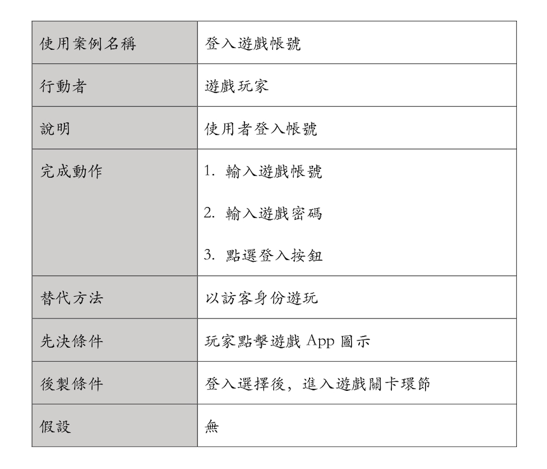
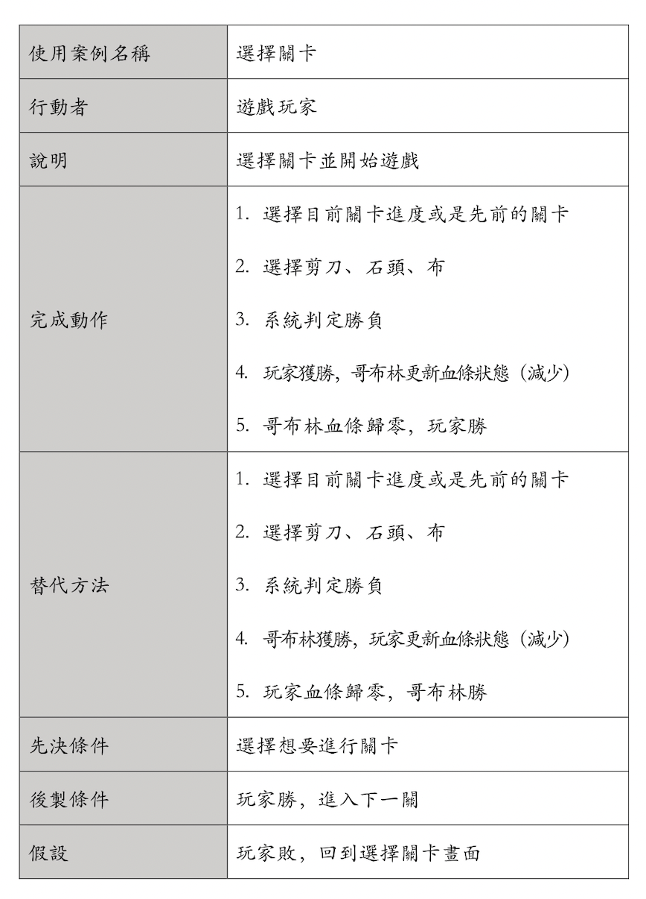
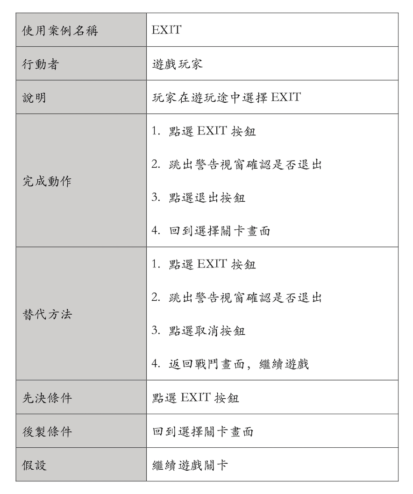

# 專題主題：哥布林大戰

| **職位** | **學號** | **姓名** | **工作內容** |
| :---:| :---:| :---:| :----: |
| **組長** | C109118142 | 徐敏容 | 介面設計、程式開發 |
| 組員 | C109118111 | 簡言蓁 | 程式開發、系統測試 |
| 組員 | C109118140 | 林俞丞 | 程式開發、程式測試 |

# 內容
利用Unity開發一個機器人，使用者可以選擇要出「剪刀」、「石頭」、「布」任一拳，機器人也會隨機出拳，若玩家贏可以攻擊機器人，玩家輸拳即會被機器人攻擊。

# 甘特圖

# PERT/CPM

關鍵路徑：１＞３＞４＞７＞８＞９

# 功能性需求及非功能性需求
功能性需求：
* APP必須有三種出拳方式供使用者選擇
* APP必須顯示哥布林的血條狀態及玩家血條狀態
* APP必須顯示每一次出拳後的結果及勝負判斷

非功能性需求：
* 每一輪只能出一次拳
* 離開遊戲之後必須刷新遊戲紀錄
* 玩家血條歸零後必須結束遊戲

# FDD

# 需求分析
1. 玩家可以藉由登入畫面登入會員，以保留前次遊戲進度
2. 玩家可以藉由註冊畫面，創建遊戲帳號
3. 玩家可以藉由選擇關卡畫面，來選擇目前關卡進度或是先前的關卡
4. 其中一方血條歸零後，畫面出現玩家勝或玩家敗
5. 玩家在遊玩途中可以點選exit鍵，跳回主畫面，並重新選擇關卡

# 使用案例

使用案例1說明

使用案例2說明

使用案例3說明

# Figma
[https://www.figma.com/file/8A1Ra8tXm25GtxZKU8bxaS/%E5%93%A5%E5%B8%83%E6%9E%97%E5%A4%A7%E6%88%B0?node-id=0%3A1](https://www.figma.com/proto/8A1Ra8tXm25GtxZKU8bxaS/%E5%93%A5%E5%B8%83%E6%9E%97%E5%A4%A7%E6%88%B0?node-id=3%3A4&scaling=scale-down&page-id=0%3A1&starting-point-node-id=3%3A4)

# DFD

