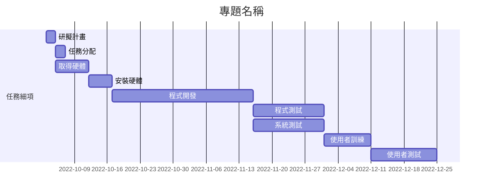

# 專題組題：

| **職位** | **學號** | **姓名** | **工作內容** |
| :---:| :---:| :---:| :----: |
| **組長** | C109118142 | 徐敏容 ||
| 組員 | C109118111 | 簡言蓁 ||
| 組員 | C109118140 | 林俞丞 ||

***
# 內容

***
# 甘特圖

***
# PERT/CPM
