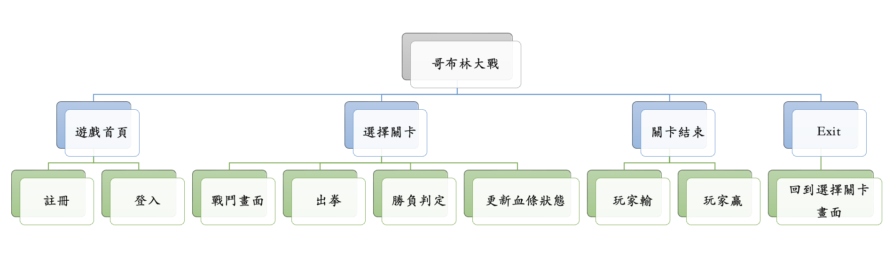
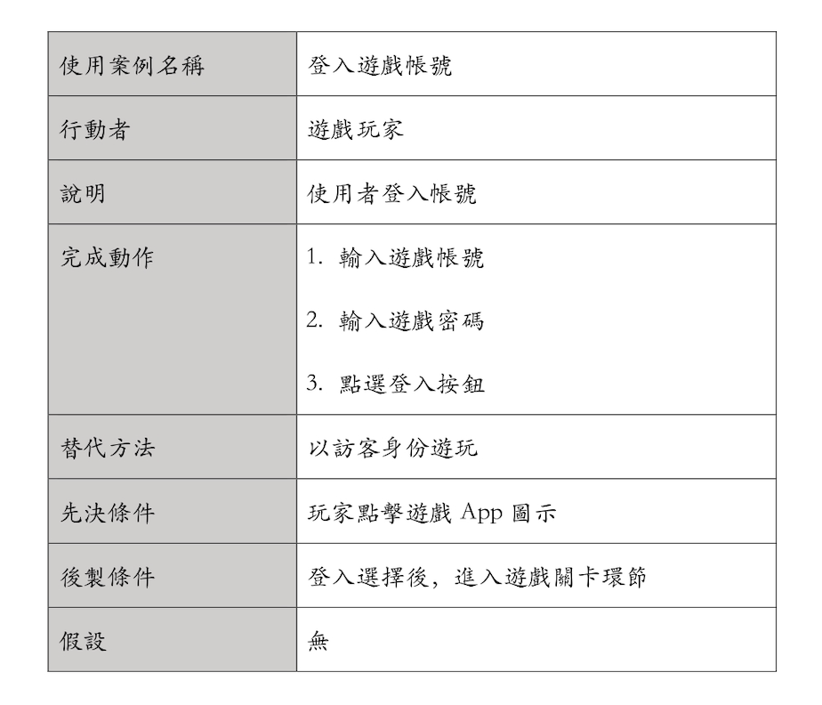
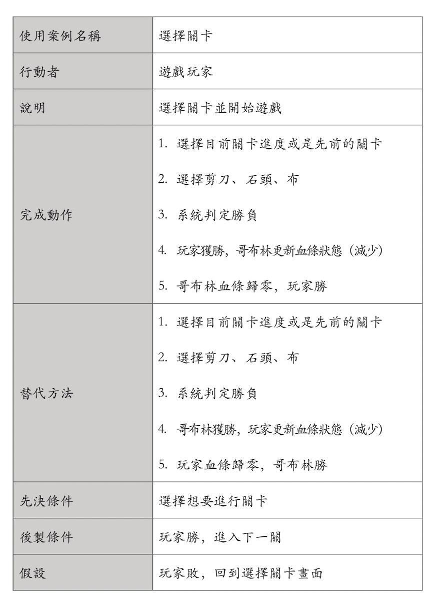
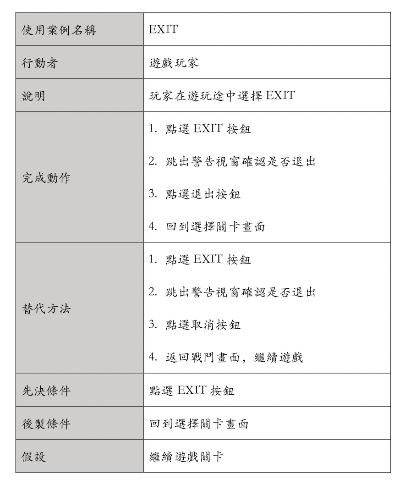

# 功能性需求及非功能性需求
功能性需求：
* 隨時儲存遊戲進度
* 提供三種不同出拳方式
* 動態更新血條狀態及勝負判定

非功能性需求：
* 資料備份，備份帳號密碼與遊戲儲存進度
* 反應時間，縮短反應時間提高玩家遊戲體驗
* 使用性，淺顯易懂的操作介面

# FDD

# 需求分析
1. 玩家可以藉由登入畫面登入會員，以保留前次遊戲進度
2. 玩家可以藉由註冊畫面，創建遊戲帳號
3. 玩家可以藉由選擇關卡畫面，來選擇目前關卡進度或是先前的關卡
4. 其中一方血條歸零後，畫面出現玩家勝或玩家敗
5. 玩家在遊玩途中可以點選exit鍵，跳回主畫面，並重新選擇關卡

# 使用案例

使用案例1說明

使用案例2說明

使用案例3說明

# Figma
[https://www.figma.com/file/8A1Ra8tXm25GtxZKU8bxaS/%E5%93%A5%E5%B8%83%E6%9E%97%E5%A4%A7%E6%88%B0?node-id=0%3A1](https://www.figma.com/proto/8A1Ra8tXm25GtxZKU8bxaS/%E5%93%A5%E5%B8%83%E6%9E%97%E5%A4%A7%E6%88%B0?node-id=3%3A4&scaling=scale-down&page-id=0%3A1&starting-point-node-id=3%3A4)
